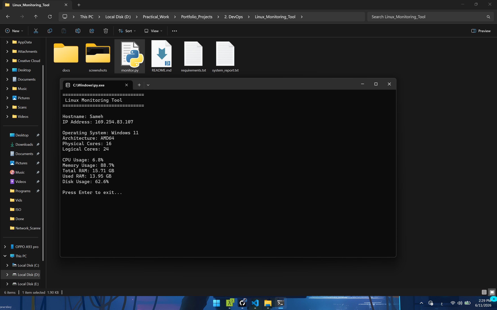
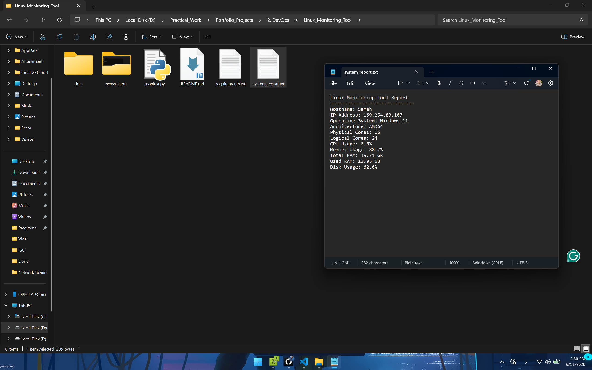

# Linux Monitoring System

## Overview

A simple monitoring tool written in Python.

## Features

- Hostname Detection
- IP Address Detection
- CPU Usage Monitoring
- RAM Usage Monitoring 
- Disk Usage Monitoring
- Operating System Information
- System Report Generation

## Technologies

- Python
- psutil
- socket
- platform

## Installation

~~~bash
pip install -r requirements.txt
~~~

## Usage

~~~bash
python monitor.py
~~~

## Screenshots

## Feature Improvement

- Export to CSV
- Email Alert
- Grafana Integration
- Docker Support